# Class Activation Maps, LRs and Optimizers

This repository contains following files:

- `S11.ipynb`: Notebook containing the main code

---

## Code Details

In the above notebook, following steps are performed to train a ResNet18 model on CIFAR10 dataset in 20 epochs

### Dataset Statistics

After importing all the modules and files in this repository, CIFAR10 statistics is printed

```python
from utils import get_cifar_statistics

get_cifar_statistics(train)
get_cifar_statistics(test, data_set_type="Test")
```

```
[Train]
 - Total Train Images: 50000
 - Tensor Shape: (3, 32, 32)
 - min: (0.0, 0.0, 0.0)
 - max: (1.0, 1.0, 1.0)
 - mean: (0.49139968, 0.48215827, 0.44653124)
 - std: (0.24703233, 0.24348505, 0.26158768)
 - var: (0.061024975, 0.05928497, 0.06842812)
[Test]
 - Total Test Images: 10000
 - Tensor Shape: (3, 32, 32)
 - min: (0.0, 0.0, 0.0)
 - max: (1.0, 1.0, 1.0)
 - mean: (0.49421427, 0.48513183, 0.45040932)
 - std: (0.24665256, 0.24289224, 0.26159248)
 - var: (0.06083748, 0.058996636, 0.06843062)
```


### Dataset Visualization

Data samples are visualized

```python
from visualize import display_cifar_data_samples

DISPLAY_SAMPLES = 20
sample, _ = train[4]
display_cifar_data_samples(train, DISPLAY_SAMPLES, classes)
```


### Augmentations

Augmentation is performed and visualized

```python
from visualize import visualize_cifar_augmentation

aug_train = AlbumDataset('./data', train=True, download=True)

aug_set_transforms = {
    'randomcrop': A.RandomCrop(height=32, width=32, p=1),
    'horizontalflip': A.HorizontalFlip(p=1),
    'cutout': A.CoarseDropout(max_holes=1, max_height=16, max_width=16, min_holes=1, min_height=1, min_width=1, fill_value=(0.49139968*255, 0.48215827*255, 0.44653124*255), mask_fill_value=None, p=1),
    'normalize': A.Normalize((0.49139968, 0.48215827 ,0.44653124), (0.24703233, 0.24348505, 0.26158768)),
    'standardize': ToTensorV2(),
}

visualize_cifar_augmentation(aug_train, aug_set_transforms)
```

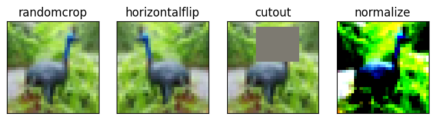


### Model Architecture

ResNet18 model is imported

```python
----------------------------------------------------------------
        Layer (type)               Output Shape         Param #
================================================================
            Conv2d-1           [-1, 64, 32, 32]           1,728
       BatchNorm2d-2           [-1, 64, 32, 32]             128
            Conv2d-3           [-1, 64, 32, 32]          36,864
       BatchNorm2d-4           [-1, 64, 32, 32]             128
            Conv2d-5           [-1, 64, 32, 32]          36,864
       BatchNorm2d-6           [-1, 64, 32, 32]             128
        BasicBlock-7           [-1, 64, 32, 32]               0
        
            Conv2d-8           [-1, 64, 32, 32]          36,864
       BatchNorm2d-9           [-1, 64, 32, 32]             128
           Conv2d-10           [-1, 64, 32, 32]          36,864
      BatchNorm2d-11           [-1, 64, 32, 32]             128
       BasicBlock-12           [-1, 64, 32, 32]               0
        
           Conv2d-13          [-1, 128, 16, 16]          73,728
      BatchNorm2d-14          [-1, 128, 16, 16]             256
           Conv2d-15          [-1, 128, 16, 16]         147,456
      BatchNorm2d-16          [-1, 128, 16, 16]             256
           Conv2d-17          [-1, 128, 16, 16]           8,192
      BatchNorm2d-18          [-1, 128, 16, 16]             256
       BasicBlock-19          [-1, 128, 16, 16]               0
        
           Conv2d-20          [-1, 128, 16, 16]         147,456
      BatchNorm2d-21          [-1, 128, 16, 16]             256
           Conv2d-22          [-1, 128, 16, 16]         147,456
      BatchNorm2d-23          [-1, 128, 16, 16]             256
       BasicBlock-24          [-1, 128, 16, 16]               0
        
           Conv2d-25            [-1, 256, 8, 8]         294,912
      BatchNorm2d-26            [-1, 256, 8, 8]             512
           Conv2d-27            [-1, 256, 8, 8]         589,824
      BatchNorm2d-28            [-1, 256, 8, 8]             512
           Conv2d-29            [-1, 256, 8, 8]          32,768
      BatchNorm2d-30            [-1, 256, 8, 8]             512
       BasicBlock-31            [-1, 256, 8, 8]               0
        
           Conv2d-32            [-1, 256, 8, 8]         589,824
      BatchNorm2d-33            [-1, 256, 8, 8]             512
           Conv2d-34            [-1, 256, 8, 8]         589,824
      BatchNorm2d-35            [-1, 256, 8, 8]             512
       BasicBlock-36            [-1, 256, 8, 8]               0
        
           Conv2d-37            [-1, 512, 4, 4]       1,179,648
      BatchNorm2d-38            [-1, 512, 4, 4]           1,024
           Conv2d-39            [-1, 512, 4, 4]       2,359,296
      BatchNorm2d-40            [-1, 512, 4, 4]           1,024
           Conv2d-41            [-1, 512, 4, 4]         131,072
      BatchNorm2d-42            [-1, 512, 4, 4]           1,024
       BasicBlock-43            [-1, 512, 4, 4]               0
        
           Conv2d-44            [-1, 512, 4, 4]       2,359,296
      BatchNorm2d-45            [-1, 512, 4, 4]           1,024
           Conv2d-46            [-1, 512, 4, 4]       2,359,296
      BatchNorm2d-47            [-1, 512, 4, 4]           1,024
       BasicBlock-48            [-1, 512, 4, 4]               0
        
           Linear-49                   [-1, 10]           5,130
================================================================
Total params: 11,173,962
Trainable params: 11,173,962
Non-trainable params: 0
----------------------------------------------------------------
Input size (MB): 0.01
Forward/backward pass size (MB): 11.25
Params size (MB): 42.63
Estimated Total Size (MB): 53.89
----------------------------------------------------------------
```


### Model Training

Training Model

```python
from training_utils import train, test, get_lr

# Data to plot accuracy and loss graphs
train_losses = []
test_losses = []
train_acc = []
test_acc = []
learning_rates = []
test_incorrect_pred = {'images': [], 'ground_truths': [], 'predicted_vals': []}

# Scheduler
scheduler = torch.optim.lr_scheduler.OneCycleLR(optimizer,
                                                max_lr=MAX_LR,
                                                steps_per_epoch=STEPS_PER_EPOCH,
                                                epochs=EPOCHS,
                                                pct_start=5/EPOCHS,
                                                div_factor=100,
                                                three_phase=False,
                                                final_div_factor=100,
                                                anneal_strategy="linear"
                                                )

# For each epoch
for epoch in range(1, EPOCHS+1):
    print(f'Epoch {epoch}')

    # Train the model on training dataset and append the training loss and accuracy
    correct, processed, train_loss = train(model, device, train_loader, optimizer, criterion, scheduler)
    train_acc.append(100 * correct / processed)
    train_losses.append(train_loss / len(train_loader))
    learning_rates.append(get_lr(optimizer))

    # Test the model's performance on test dataset and append the training loss and accuracy
    correct, test_loss = test(model, device, test_loader, criterion)
    test_acc.append(100. * correct / len(test_loader.dataset))
    test_losses.append(test_loss)
```

```
Epoch 1
Train: Loss=1.4166 Batch_id=97 Accuracy=35.25: 100%|██████████| 98/98 [00:13<00:00,  7.13it/s]
Test set: Average loss: 0.0030, Accuracy: 4619/10000 (46.19%)

Epoch 2
Train: Loss=1.0000 Batch_id=97 Accuracy=59.00: 100%|██████████| 98/98 [00:13<00:00,  7.15it/s]
Test set: Average loss: 0.0020, Accuracy: 6249/10000 (62.49%)

Epoch 3
Train: Loss=0.6956 Batch_id=97 Accuracy=69.82: 100%|██████████| 98/98 [00:13<00:00,  7.15it/s]
Test set: Average loss: 0.0017, Accuracy: 7005/10000 (70.05%)

Epoch 4
Train: Loss=0.5859 Batch_id=97 Accuracy=76.14: 100%|██████████| 98/98 [00:13<00:00,  7.14it/s]
Test set: Average loss: 0.0018, Accuracy: 7081/10000 (70.81%)

Epoch 5
Train: Loss=0.5270 Batch_id=97 Accuracy=79.94: 100%|██████████| 98/98 [00:13<00:00,  7.14it/s]
Test set: Average loss: 0.0018, Accuracy: 7196/10000 (71.96%)

Epoch 6
Train: Loss=0.5406 Batch_id=97 Accuracy=83.11: 100%|██████████| 98/98 [00:13<00:00,  7.13it/s]
Test set: Average loss: 0.0013, Accuracy: 7785/10000 (77.85%)

Epoch 7
Train: Loss=0.3658 Batch_id=97 Accuracy=85.19: 100%|██████████| 98/98 [00:13<00:00,  7.12it/s]
Test set: Average loss: 0.0020, Accuracy: 7197/10000 (71.97%)

Epoch 8
Train: Loss=0.4369 Batch_id=97 Accuracy=87.64: 100%|██████████| 98/98 [00:13<00:00,  7.13it/s]
Test set: Average loss: 0.0015, Accuracy: 7724/10000 (77.24%)

Epoch 9
Train: Loss=0.2911 Batch_id=97 Accuracy=89.58: 100%|██████████| 98/98 [00:13<00:00,  7.14it/s]
Test set: Average loss: 0.0014, Accuracy: 7951/10000 (79.51%)

Epoch 10
Train: Loss=0.2396 Batch_id=97 Accuracy=91.05: 100%|██████████| 98/98 [00:13<00:00,  7.13it/s]
Test set: Average loss: 0.0013, Accuracy: 8017/10000 (80.17%)

Epoch 11
Train: Loss=0.1986 Batch_id=97 Accuracy=92.58: 100%|██████████| 98/98 [00:13<00:00,  7.13it/s]
Test set: Average loss: 0.0014, Accuracy: 7875/10000 (78.75%)

Epoch 12
Train: Loss=0.2204 Batch_id=97 Accuracy=93.83: 100%|██████████| 98/98 [00:13<00:00,  7.12it/s]
Test set: Average loss: 0.0012, Accuracy: 8212/10000 (82.12%)

Epoch 13
Train: Loss=0.1430 Batch_id=97 Accuracy=94.76: 100%|██████████| 98/98 [00:13<00:00,  7.14it/s]
Test set: Average loss: 0.0013, Accuracy: 8201/10000 (82.01%)

Epoch 14
Train: Loss=0.1877 Batch_id=97 Accuracy=95.82: 100%|██████████| 98/98 [00:13<00:00,  7.13it/s]
Test set: Average loss: 0.0011, Accuracy: 8449/10000 (84.49%)

Epoch 15
Train: Loss=0.0935 Batch_id=97 Accuracy=96.65: 100%|██████████| 98/98 [00:13<00:00,  7.14it/s]
Test set: Average loss: 0.0011, Accuracy: 8460/10000 (84.60%)

Epoch 16
Train: Loss=0.0879 Batch_id=97 Accuracy=97.59: 100%|██████████| 98/98 [00:13<00:00,  7.14it/s]
Test set: Average loss: 0.0011, Accuracy: 8596/10000 (85.96%)

Epoch 17
Train: Loss=0.0485 Batch_id=97 Accuracy=98.03: 100%|██████████| 98/98 [00:13<00:00,  7.13it/s]
Test set: Average loss: 0.0011, Accuracy: 8572/10000 (85.72%)

Epoch 18
Train: Loss=0.0298 Batch_id=97 Accuracy=98.74: 100%|██████████| 98/98 [00:13<00:00,  7.13it/s]
Test set: Average loss: 0.0010, Accuracy: 8707/10000 (87.07%)

Epoch 19
Train: Loss=0.0423 Batch_id=97 Accuracy=99.06: 100%|██████████| 98/98 [00:13<00:00,  7.13it/s]
Test set: Average loss: 0.0009, Accuracy: 8781/10000 (87.81%)

Epoch 20
Train: Loss=0.0137 Batch_id=97 Accuracy=99.19: 100%|██████████| 98/98 [00:13<00:00,  7.14it/s]
Test set: Average loss: 0.0009, Accuracy: 8828/10000 (88.28%)
```


- One Cycle Policy is used to train the models. Following is the graph showing model accuracy and loss on train and test dataset

  ```python
  # Print loss and accuracy
  from visualize import display_loss_and_accuracies
  
  display_loss_and_accuracies(train_losses, train_acc, test_losses, test_acc)
  ```

  

### Misclassified Images

Misclassified images are visualized

```python
from utils import get_misclassified_data
from visualize import display_cifar_misclassified_data

# Denormalize the data using test mean and std deviation
inv_normalize = transforms.Normalize(
    mean=[-0.4942/0.2466, -0.4851/0.2428, -0.4504/0.2615],
    std=[1/0.2466, 1/0.2428, 1/0.2615]
)

# Get the misclassified data from test dataset
misclassified_data = get_misclassified_data(model, device, test_loader)

# Plot the misclassified data
display_cifar_misclassified_data(misclassified_data, classes, inv_normalize, number_of_samples=10)
```


### GradCam

GradCam is used to visualize the activations of the detected class on the misclassified images

#### Layer 4 [Objects]

The heatmap highlights the region of the image, which is considered to be **classified object** by the network

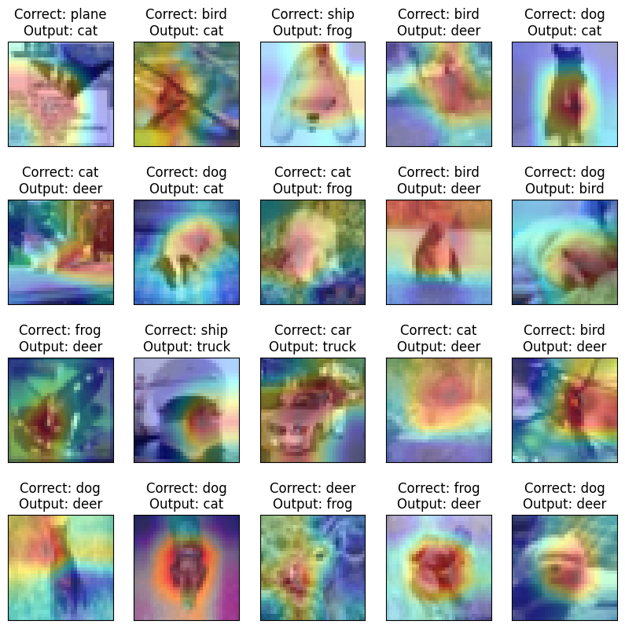


#### Layer 3 [Parts of the Objects]

The heatmap highlights the region of the image, which is considered to be **parts of the classified object** by the network

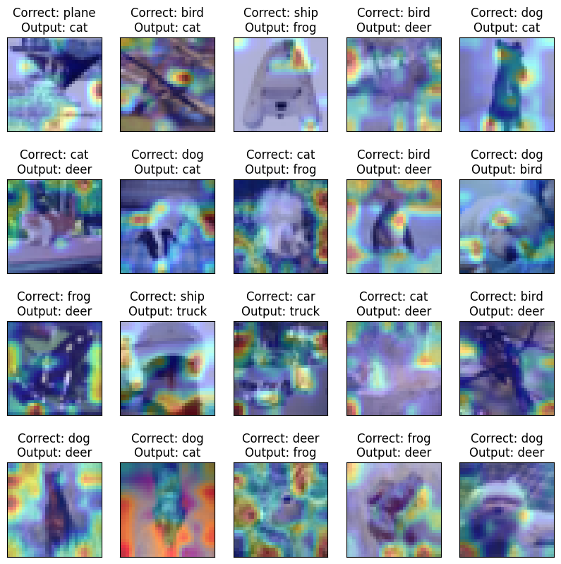


#### Layer 2 [Textures and Patterns]

The heatmap highlights the region of the image, which is considered to be **textures and patterns of the classified object** by the network

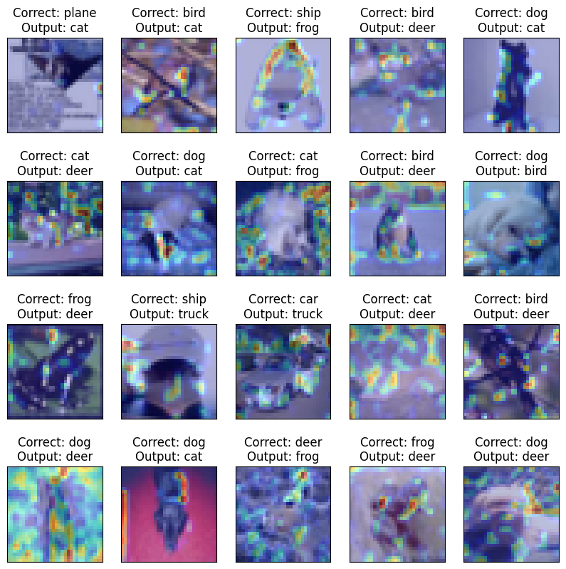


#### Layer 1 [Edges and Gradients]

The heatmap highlights the region of the image, which is considered to be **edges and gradients of the classified object** by the network

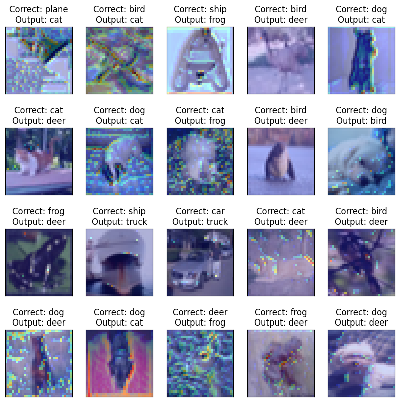


### Confusion Matrix

Confusion matrix after model is trained for 20 epochs

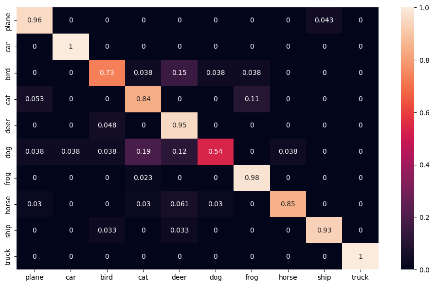

---


# Some concepts from Session 11:

## Adversarial Images

**How do we create adversarial images?**

1. Choose an input image and its label: Start with a clean image, labeled as a specific class, which you want the network to misclassify.
2. Define the loss function: The loss function should measure the difference between the predicted class and the target class, usually the opposite of the true class.
3. Calculate the gradient of the loss with respect to the input image: This step is done using backpropagation and it gives information on how the loss changes as the input image are changed.
4. Perturb the input image: Add a small, but targeted perturbation to the input image, proportional to the gradient calculated in the previous step. This is done to maximize the loss and hence, change the predicted class.
5. Repeat steps 3 and 4 until the desired misclassification is achieved: You may need to repeat these steps multiple times to generate a strong enough perturbation that causes the network to misclassify the image.
6. Clip the pixel values of the perturbed image if needed: Clipping ensures that the perturbed image remains visually similar to the original image and falls within a specified range of pixel values.


## GradCam

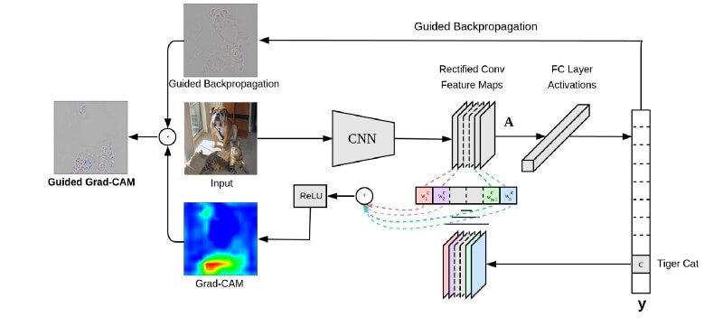

Grad-CAM algorithm for visualizing the important regions of an input image that contribute to the predictions of a model can be implemented in the following steps:

1. Load the pre-trained VGG model: The first step is to load a pre-trained VGG model, which has already been trained on a large dataset.
2. Load the input image: Next, you would load the input image that you want to analyze.
3. Inferring: Run the model's forward pass to obtain the final class scores and prediction.
4. Output of the last Convolutional layer: Extract the feature maps of the last Convolutional layer before the final fully connected layers.
5. Computing Gradients: Compute the gradients of the final class scores with respect to the feature maps.
6. Pooling the Gradients: Pool the gradients spatially, typically by taking the average along the height and width dimensions.
7. Weighing the outputs: Multiply the feature maps with the pooled gradients to get the weighted feature maps.
8. Averaging Feature Maps along Channels: Sum the weighted feature maps along the channel dimension to get the final activation map.
9. Normalizing the Heatmap: Normalize the activation map to obtain the final Grad-CAM heatmap, which highlights the regions of the input that were important for the prediction.

 

This heatmap can be overlaid on the input image to visualize the regions that were important for the model's prediction. 

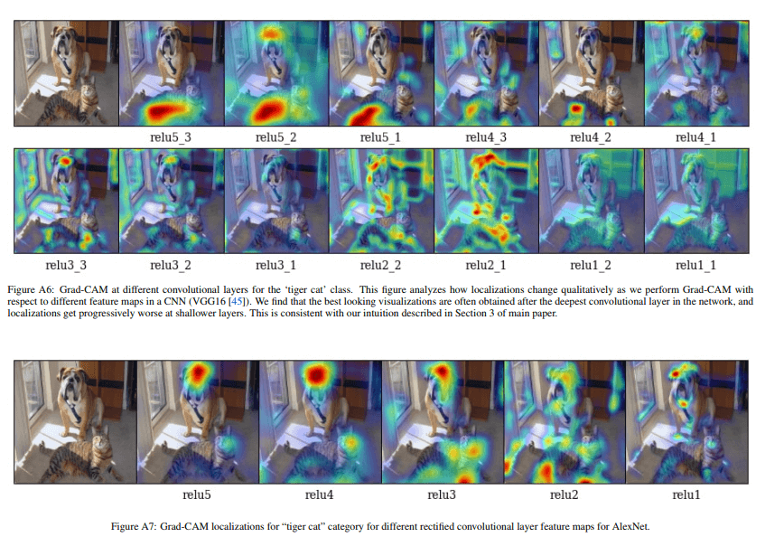


### Applications

- GradCam is used on Adversarial images to check the activations for a particular class

  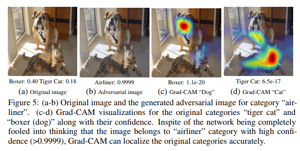

- It can also be used to check if the model is biased

  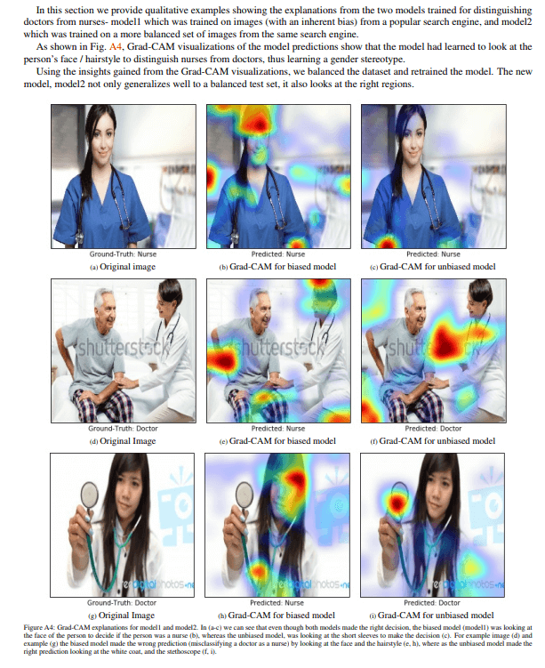

- It is also used on misclassified images to check which regions the model is focusing on. Using this information appropriate augmentation strategy can be used to improve the performance of the model


## Optimizers

- Optimizer algorithms like Gradient Descent and Stochastic Gradient Descent use constant value of learning rate while updating the weights

- While Adaptive Optimizers such as Adagrad, Adadelta, RMSProp, and Adam use adaptive learning rates

  

### **Gradient Descent**: 

- It calculates the gradient for the whole dataset and updates in a direction opposite to the gradients until we find local minima


### **Stochastic Gradient Descent** 

- It performs a parameter update for each batch instead of the whole dataset. This is much faster and can be further improved through momentum and learning rate finder


### Adagrad

- It is more preferable for a sparse data set as it makes big updates for infrequent parameters and small updates for frequent parameters 
- It uses a different learning rate for each parameter at a time step based on the past gradients which were computed for that parameter. Thus we do not need to manually tune the learning rate. 


### RMSProp

- RMSprop adjusts the learning rate dynamically for each parameter in the model, instead of using a fixed learning rate for all parameters
- It does this by dividing the learning rate by an exponentially decaying average of the squared gradients for each parameter. 
- This helps to avoid oscillation or divergence in the optimization process, and allows the model to converge faster and more accurately
- The features which are more frequent gets low learning rate change while the features will occur less frequently gets high learning rate change. This allows to learn faster from less frequent features 


### Adam

- It is the extension of RMSProp
- It stands for Adaptive Moment Estimation. It also calculates a different learning rate. Adam works well in practice, is faster and outperforms other techniques
- Here, we not only take the square of the loss but also the weighted value of the past gradient updates


Below is the comparison of different optimizers trained on CIFAR10

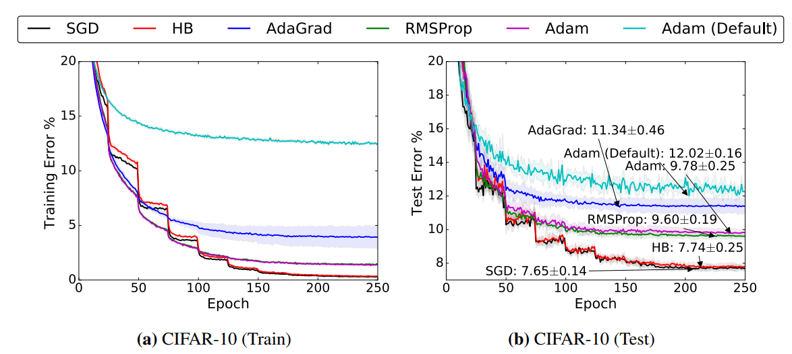

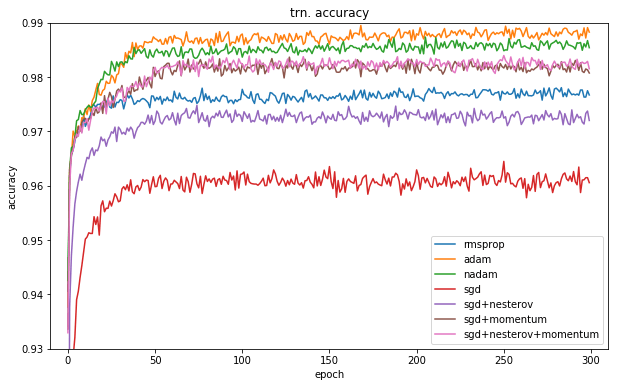

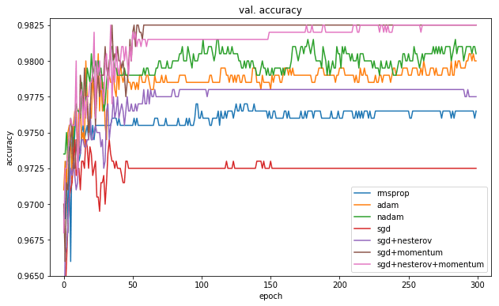

1. Adam and others generally have the lowest training error/loss, but not validation error/loss
2. It is common to use SGDs for SOTA performance.
   1. ResNet (2015) - SGD
   2. DenseNet (2016) - SGD
   3. ResNeXt (2016) - SGD
   4. SE-Net (2017) - SGD
   5. NasNet (2018) - SGD
   6. BERT (2018) - Adam
   7. EfficientNet (2019) - RMSprop
   8. GPT-3 (2020) - AdamW
   9. RegNet (2020) - AdamW
   10. ViT (2021) - AdamW
3. Adam and others are [preferredLinks to an external site.](https://arxiv.org/pdf/1705.08292.pdf) for GANs and Q-learning with function approximations
4. SGD needs lesser memory since it only needs the first momentum
5. It has a much better regularization property compared to Adam (this can be fixed, see e.g  [Fixing Weight Decay Regularization in AdamLinks to an external site.](https://openreview.net/forum?id=rk6qdGgCZ) )
6. If your input data is sparse you are likely to achieve the best results using one of the adaptive learning-date methods.
7. Use SGD for CNN
8. Use Adam for model with fully connected layers
